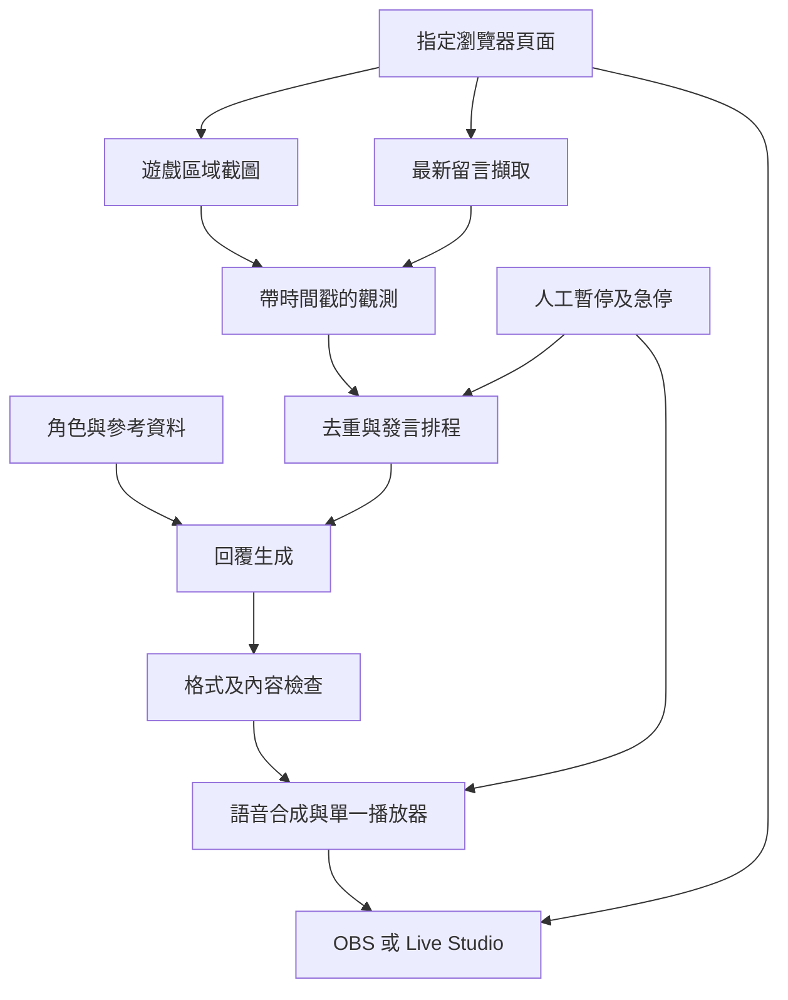

# Auto Reply Bot 完整專案規劃 v0.1
日期：2026-09-22
狀態：設計提案，尚未執行實機驗證

## 1. 目標與節目體驗

做出一個能看遊戲畫面、接住觀眾留言、以固定角色自然說話的互動節目。觀眾看到的是連續遊戲畫面，聽到的是對當下情境有反應的主持聲音，而非 agent 操作介面或技術日誌。每次發言 1 至 3 句，有內容才說，容許停頓，不必每次輪詢都發言。

角色的個性、慣用語、情緒幅度、背景知識與禁忌可調整。自然度以盲聽評分、情境相關性及回應延遲驗收，不以欺騙觀眾或假冒特定真人作為成功指標。對 AI 身分的提問如實回答；平台要求的 AI 內容標示於試播前確認。

## 2. 範圍及必要假設

首版只支援一台直播電腦、一個指定瀏覽器頁面、一個留言來源、一個中文角色、一個 TTS 聲音及一個直播輸出工具。只讀遊戲，不代玩、不點擊下注、不代觀眾發送留言。遊戲可以由人操作或既有來源播放；本案不負責生成遊戲影像。

Windows 11 + Chromium + OBS 是候選驗證基線，尚未確認使用者設備。若實際為 macOS，需另驗音訊擷取及權限，不直接套用 Windows 設定。TikTok Live Studio 為替代輸出路徑，不能先假定帳號直播權限、擷取介面或與 OBS 的串接已可用。

本機執行程序與雲端模型可混合使用。「本機操作」不等於模型離線運算，雲端推論會送出裁切圖片與必要留言。第一版不需要 Railway、資料庫叢集、向量資料庫、多角色調度或自動開播。

## 3. 系統分工

| 層 | 責任 | 首版做法 |
| --- | --- | --- |
| 開發及操作 agent | 建置、設定、診斷、產生修正 | Claude Code 或 Codex；具體權限依環境驗證 |
| 本機執行程序 | 定時採集、狀態管理、排程、播放、急停 | 單一服務，明確介面及有界佇列 |
| 多模態推論 | 解讀截圖與留言，依角色產生回覆 | 可替換 provider，先驗一個可用來源 |
| 直播工具 | 擷取連續遊戲畫面與主持音軌 | OBS 本地錄影先行；其後才串流 |

保留「agent 直接操作瀏覽器及呼叫工具」的快速探索模式，用來驗證單次讀取及回話；正式長時間循環由本機程序承擔。若選 CLI agent 作為每輪推論引擎，必須驗證圖片輸入、結構化輸出、程序終止、速率限制與授權方式，不能假定訂閱提供無限、無人值守服務。

Grok Bot 目前僅是使用者提供的候選名稱，具體產品、版本、官方介面與本機能力待查證。Claude Code、Codex、Grok Bot 不視為能力等價的可直接替換工具。

## 4. 資料流

直播畫面由 OBS 或 Live Studio 直接擷取，模型分析用的定期截圖是另一條資料流，不用低頻截圖充當直播影像。控制台、金鑰與日誌不進直播畫面。

### 4.1 画面及留言採集

指定 URL、頁面識別與遊戲裁切區，避免抓取整個桌面。優先驗證 Playwright 元素截圖；對 Canvas、WebGL、遮擋、最小化或跨來源框架，需以實機檢查是否黑畫面或停更。必要時使用本機視窗擷取替代，兩者共用觀測介面。

留言優先順序：平台允許的官方介面、可讀 DOM、最後才是留言區 OCR。對實際來源確認登入及使用限制；不以規避登入、驗證碼或存取限制作為方案。開發用獨立瀏覽器設定檔，操作者自行登入，不匯出個人瀏覽器 cookie。

留言記錄 source、message_id、收到時間、來源時間（若有）、文字及可選顯示名稱。無穩定 ID 時，以文字、作者與時間窗口做暫時去重；OCR 須比對前後視窗、處理同一句真實重複留言及低信心結果。連線重建時預設從現在起收，不朗讀整段歷史留言。

### 4.2 觀測與情境

每次觀測含 observation_id、sequence、captured_at、received_at、frame_ref、frame_hash、chat_ids、source_health。圖片與留言以收到時間對齊；來源時間可能有誤差，不可盲信。保留上一張有效畫面及最近 10 次已播放回覆，提供短期上下文。

靜態參考資料先用 Markdown/JSON：遊戲規則、常用名詞、角色背景、允許談論的節目設定。區分可證實畫面事實、參考知識及模型推測。畫面不明確就少說，不自創勝負、分數或觀眾身份。

### 4.3 發言排程

起始設定：畫面每 2 秒採樣，留言每 1 秒讀取；只在有新事件、可回答留言或適當空檔時呼叫模型，最快每 5 秒一次。這些是待測數值。

優先處理相關且可回答的新留言，其次重要遊戲變化，最後是有新資訊的空檔評論。一般發言 1 至 3 句，約 20 至 80 個中文字；超長回覆丟棄或走一次受限重寫，不直接硬切成破句。30 秒無新資訊可持續安靜，不靠罐頭填滿空白。

同時最多一個生成工作、一個播放工作；等待發言最多一筆，採最新相關事件替換。畫面事件預設 12 秒失效，留言預設 30 秒失效，於生成前、TTS 前及播放前檢查。不要把舊比賽結果在新局播出。

急停切換 session_generation，取消生成與合成、清空佇列並停止正在播放的聲音；即使外部呼叫稍後返回，也必須丟棄舊 generation 結果。重新啟動不重播先前半段聲音。一般新留言不強行截斷正在說的話。

### 4.4 角色及輸出

角色資料含 persona_id、版本、語言、個性、詞彙、慣用語上限、避免用語、聲音、參考資料版本。先用「親切、反應快、有輕微幽默感、不挖苦觀眾」作可替換預設，不當作使用者已選定的人設。

模型只回 JSON：speak、utterance、reply_to_ids、observation_id、reason_code。播放器只接受通過 schema、長度、時效與內容檢查的 utterance。reason_code 供記錄，不播放推理或系統提示。

留言、截圖中文字、OCR 與外部參考文字都只是資料，不能改寫系統指令。推論層無 shell、檔案、瀏覽器操控及金鑰讀取能力；工具操作由固定程序完成。拒絕「忽略規則、讀出密碼、打開網址」等留言指令，仍可正常回答遊戲問題。

### 4.5 語音及直播

TTS 介面輸入文字、聲音 ID、語速，輸出音檔或串流與時長資訊。先比較一個本機候選與一個雲端候選的繁中自然度、延遲、費用及商用聲音授權；定案只實作一個。沒有供應商憑證時使用 mock 驗證流程，但不能將 mock 宣稱為真實 TTS 通過。

獨立播放器讓遊戲與主持音軌可分開調音。本機可透過耳機監聽；避免麥克風再次收到喇叭聲。音量降低、暫停、恢復與急停都不依賴模型回應。

OBS：遊戲視窗擷取加主持播放器音訊來源，先錄影再檢查聲音。若單一應用程式擷取不可用，再驗證虛擬音訊裝置。避免同時擷取同一聲音的應用來源及桌面來源，以免回音。TikTok Live Studio 另做直接視窗擷取及音源選擇驗證，不預設 OBS 虛擬攝影機攜帶音訊。

模型生成耗時不應阻塞遊戲影像。初版可加當句字幕，但不是跑通流程的必要條件。公開試播前由操作者檢查節目 AI 標示、聲音使用權及帳號直播資格；本輪不登入或啟動直播。

## 5. 建議程式邊界

候選語言 TypeScript + Node.js，便於同一程序整合 Playwright、事件排程及控制台；Claude 可基於 OS/TTS 支援提出更精簡的 Python 替代，但只選一套主流程。

建議未來路徑：
- src/capture：browser、window、chat adapters。
- src/context：觀測、去重、短期記憶及參考資料。
- src/director：優先級、時效、狀態與發言決策。
- src/providers：多模態與 TTS adapters。
- src/audio：單一播放器、音源、急停。
- src/control：本機控制頁或 CLI，預設只綁 localhost。
- fixtures：可公開的合成截圖與留言。
- tests：去重、失效、排程、取消及故障案例。

狀態需明確區分 STOPPED、IDLE、GENERATING、SYNTHESIZING、PLAYING、PAUSED、ERROR。下一輪 Claude 要定義允許轉換及取消語義。介面至少有 CaptureAdapter、ChatAdapter、ModelProvider、TtsProvider、AudioPlayer；有 mock 才能在無直播設備環境測試。

## 6. 故障與資源邊界

| 情況 | 預期行為 |
| --- | --- |
| 頁面斷線或截圖失效 | 停止依賴該畫面的評論，顯示來源異常，不重複講舊畫面 |
| 留言中斷 | 可繼續有效遊戲評論，顯示留言來源離線 |
| 模型逾時或 429 | 本事件不重試，短暫冷卻後處理新事件，禁止佇列堆積 |
| TTS 失敗 | 不播放錯誤或半成品，記錄失敗，不換付費來源 |
| 音效裝置消失 | 停止播放並提示操作者，恢復後丟棄舊回覆 |
| 連續三次 provider 失敗 | 暫停該來源 30 秒，再探測一次；仍失敗則維持暫停 |
| 費用或額度達上限 | 停止新付費呼叫，保留人工控制及直播畫面 |
| 急停 | 停當前聲音、取消待處理工作、丟棄晚到結果 |

預设 mock 模式。付費呼叫上限每分鐘 12 次，單次回覆 output token 候選上限 180；圖片長邊候選 1280，每次最多 2 張，留言最多 20 則及總長 2000 字，參考資料最多 4000 字。模型真正 token 上限及圖片計費方式由 provider adapter 定義並量測。

美元每小時及每場預算未授權，範本留 null。不能把 null 當無上限，付費模式啟用前必须填入已授權上限與版本化費率；預估下一次上界超預算就停止。訂閱 CLI 無逐次費率時另記呼叫量、速率限制及可用額度，費用標 UNKNOWN，不冒充零成本。

成本模型：每小時模型費用 = 實際呼叫數 × 每次文字與圖片成本，加上 TTS 字數或音訊長度費用。以量測資料報告每小時成本，不用憑空單價。使用量未知時標示未知並依呼叫數硬上限運作。

日誌含觀測 ID、選取 chat IDs、回覆、各階段時間、丟棄原因、播放開始及結束、provider 用量；不保存金鑰或完整瀏覽器狀態。畫面預設記憶體暫存，除錯留存需限量；原始音檔預設 24 小時輪替，文字日誌 7 日。公開 repo 只放合成或去識別樣本，真實留言及錄影不自動 push。

## 7. 階段交付與驗收

| 階段 | 工作 | 交付及通過条件 |
| --- | --- | --- |
| P0 詳細規劃 | Claude 檢查能力、選技術、列依賴 | 設計、介面、任務表、PoC 步驟與未知項目；無程式完成宣稱 |
| P1 離線循環 | 合成截圖、留言與 mock providers | 30 分鐘回播；去重、過期、取消、故障案例可重現 |
| P2 本機循環 | 真實指定頁面、模型、TTS、音效裝置 | 30 分鐘實機執行，能看見遊戲並回應留言，附各階段延遲 |
| P3 錄影及試播 | OBS 錄影，之後受控直播 | 錄影有連續遊戲與清晰主持聲、無重複擷取；試播另確認接收端延遲 |
| P4 穩定度 | 2 小時壓力及來源中斷恢復 | 無無界佇列、成本守限、人工可接管；再評估是否擴展 |

P1 至 P4 是後續路線，不是本轮要求 Claude 全部實作。P0 完成先交回 review，避免先做大型平台。

候選驗收值：
1. 以至少 100 個可控事件測量「本機收到事件至開始播放」中位數 ≤ 6 秒、p95 ≤ 12 秒；同時報告樣本數、過期丟棄率及回覆覆蓋率，不能靠丟棄大部分事件達標。
2. 100 則帶穩定 ID 的合成留言中，重複播放同一 ID 為 0；OCR 路線另報誤讀及誤去重，不混成一個漂亮分數。
3. 完整回覆皆為 1 至 3 句，無重疊播放。測試急停 10 次，目標每次 1 秒內停止本機聲音，且無晚到重播。
4. 用含舊觀測、跨局與重新連線事件的案例證明過期內容不播出。
5. 至少 30 段情境盲聽，操作者對自然度、角色一致性、相關性各評 1 至 5 分，候選平均 ≥ 4，逐項報告。
6. 本機延遲與平台傳送至觀眾的延遲分開量測；OBS 錄影成功不等於觀眾端直播驗證。
7. 對留言注入、provider timeout、TTS 失敗、音效拔除及超額度有可重播案例。
8. CI 只能驗證純程式部分，本機音源與平台接收端必須實機記錄，缺設備就標待驗證。

## 8. 尚需確認但不阻塞 P0 的資訊

實際 OS、CPU/GPU/RAM、瀏覽器及版本；遊戲 URL 及顯示方式；留言平台與可讀結構；角色及聲音偏好；可用模型/TTS 的授權方式；每小時預算；OBS 或 Live Studio 的實際使用版本與直播權限。

Claude 應先採上述候選基線產出完整設計，再將真正影響 P2 的問題集中成最多五題。不要在無法取得本機設備時停掉可完成的 mock 設計。

## 9. 資料來源及查證界線

2026-09-22 已讀：
- [Playwright screenshots](https://playwright.dev/docs/screenshots)：支援頁面、元素截圖及記憶體 buffer。這只支持採集候選，不證明目標遊戲可擷取。
- [OBS Application Audio Capture](https://obsproject.com/kb/application-audio-capture-guide)：說明 Windows 應用音訊擷取、重複桌面音訊導致回音及虛擬音訊替代。不能外推成所有 OS 通用。
- [Claude Code programmatic usage](https://code.claude.com/docs/en/headless)：提供程式化使用文件。圖片格式、工具權限、授權及長時間工作行為仍需按選定版本驗證。

本文件中的排程、程式邊界、效能數字與分階段方案是本專案設計建議，不是上述文件的官方保證。未查證 Grok Bot、Codex 本機整合或 TikTok Live Studio 的具體產品能力。
